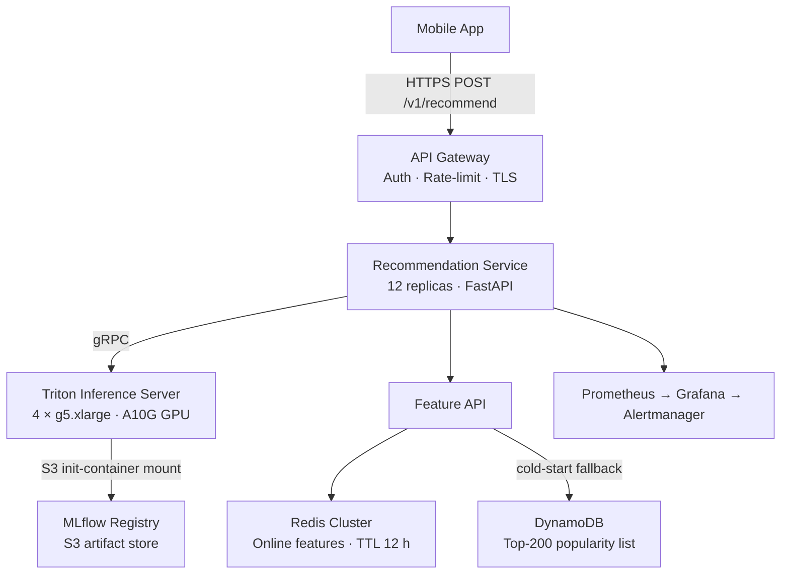

# Recommender System — MLOps Design Dossier
**Scenario X: Personalized In-App Recommendations (B2C Retail)**

---

## Executive Summary

This repository contains a complete MLOps design dossier for a real-time personalized product recommendation system serving a B2C mobile retail application. The system delivers ranked product recommendations on every home-screen load using a two-stage ML pipeline (two-tower retrieval + XGBoost ranker), served via Triton Inference Server on GPU-backed Kubernetes pods. Model weights are mounted at runtime from S3, enabling A/B model swaps in ~2–3 minutes without image rebuilds. The design handles ~800 RPS at peak with a p95 end-to-end latency budget of 120 ms, supports continuous A/B experimentation between Champion and Challenger model versions, and includes full CI/CD, monitoring, and rollback automation.

---

## Architecture Diagram

Full diagram with latency budget breakdown: [architecture/architecture.md](architecture/architecture.md)

---

## Key Numbers

| Parameter | Value | Source |
|---|---|---|
| Target RPS (peak) | 800 | Product requirement |
| p95 latency budget | 120 ms end-to-end | Product requirement |
| Availability SLO | 99.9% (43 min/month error budget) | [serving/slos.yaml](serving/slos.yaml) |
| Retrieval model size | ~420 MB (two-tower ONNX) | [lifecycle/model-registry.yaml](lifecycle/model-registry.yaml) |
| Ranker model size | ~18 MB (XGBoost ONNX) | [lifecycle/model-registry.yaml](lifecycle/model-registry.yaml) |
| Hardware (model server) | AWS g5.xlarge — 1× NVIDIA A10G (24 GB VRAM) | [serving/capacity-plan.md](serving/capacity-plan.md) |
| Rec Service replicas | 12 (HPA: 6–16) | [serving/capacity-plan.md](serving/capacity-plan.md) |
| Triton replicas | 4 | [serving/capacity-plan.md](serving/capacity-plan.md) |
| Monthly cost estimate | ~$4,200/month | [serving/capacity-plan.md](serving/capacity-plan.md) |

---

## Navigation

| Area | Primary Artifact |
|---|---|
| **Architecture & ADRs** | [architecture.md](architecture/architecture.md) · [JUSTIFICATION.md](architecture/JUSTIFICATION.md) · [ADR-0001: Two-tower vs Transformer](architecture/adr/0001-two-tower-vs-transformer.md) · [ADR-0002: Mount vs Bake](architecture/adr/0002-model-mount-vs-bake.md) |
| **ML Lifecycle & Registry** | [lifecycle.md](lifecycle/lifecycle.md) · [model-registry.yaml](lifecycle/model-registry.yaml) |
| **Container Plan** | [Dockerfile](container/Dockerfile) · [container/README.md](container/README.md) |
| **API Contract** | [openapi.yaml](api/openapi.yaml) · [examples/](api/examples/) |
| **Capacity & SLOs** | [capacity-plan.md](serving/capacity-plan.md) · [slos.yaml](serving/slos.yaml) · [load-test-plan.md](serving/load-test-plan.md) |
| **CI/CD Pipeline** | [deploy-model.yml](cicd/.github/workflows/deploy-model.yml) |
| **Monitoring & Alerts** | [alerts.yaml](monitoring/alerts.yaml) |
| **Rollback Runbook** | [rollback.md](runbooks/rollback.md) |

---

## Open Questions

1. **Feature freshness vs. cost trade-off:** The Spark pipeline refreshes user features every 4 hours. If the product team requires sub-hour freshness for new user segments, a real-time Kafka → Flink pipeline would add ~$800/month and significant operational complexity. This trade-off needs alignment with product and platform teams before building.

2. **ANN index refresh cadence:** The two-tower retrieval model requires a nightly ANN index rebuild when the product catalogue changes. If catalogue churn accelerates (e.g., flash sales adding thousands of SKUs per hour), the nightly cadence may be insufficient. The index rebuild pipeline SLA needs to be confirmed with the data engineering team.

3. **GPU availability and reserved capacity:** Triton pods run on On-Demand g5.xlarge instances. If AWS capacity becomes constrained in the target region during peak traffic spikes, scaling out additional Triton replicas may be delayed. A reserved instance commitment or multi-region failover strategy should be evaluated before production launch.
