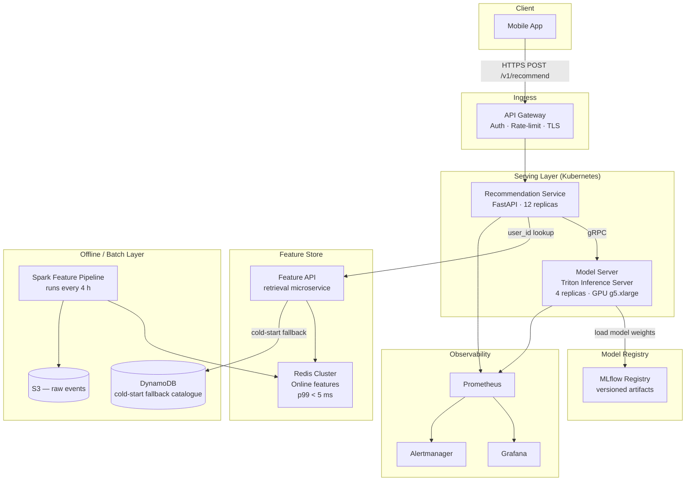
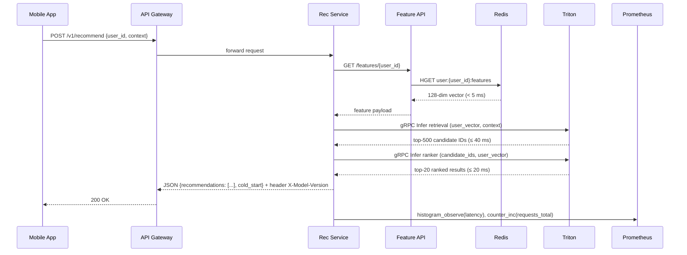
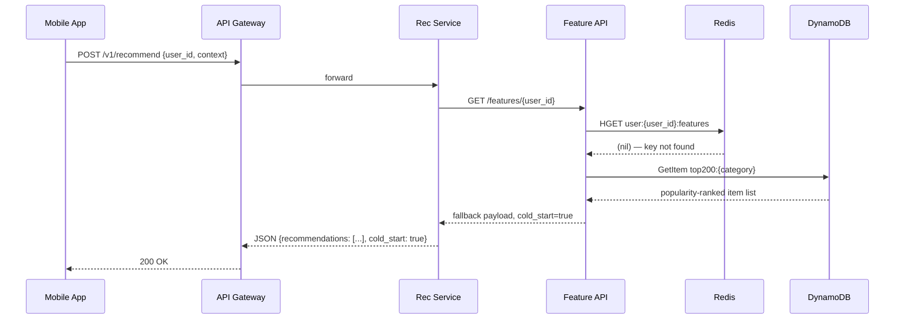

# Architecture — Scenario X: Personalized In-App Recommendations

## System Overview

This document describes the end-to-end architecture for the real-time personalized product
recommendation service serving a B2C mobile retail application. The system handles ~800 RPS
at peak with a p95 end-to-end latency budget of 120 ms.

---

## High-Level Architecture Diagram

---

## Latency Budget Breakdown

The 120 ms end-to-end p95 budget is allocated as follows:

| Segment | Budget | Notes |
|---|---|---|
| Network (client → gateway) | 15 ms | CDN edge termination |
| API Gateway overhead | 5 ms | Auth token validation, rate-limit check |
| Feature retrieval (Redis) | 10 ms | Pre-computed user vectors, p99 < 5 ms |
| gRPC transport (service → Triton) | 5 ms | In-cluster, same AZ |
| Two-tower retrieval (Triton) | 40 ms | Returns top-500 candidate item IDs |
| Lightweight ranker (Triton) | 20 ms | Scores top-500 → top-20 final results |
| Response serialization + network back | 15 ms | JSON, ~2 KB payload |
| **Total budget used** | **110 ms** | 10 ms headroom |

---

## Component Descriptions

### API Gateway
- **Product:** AWS API Gateway (HTTP API mode) + AWS WAF
- **Responsibilities:** TLS termination, JWT validation, per-user rate limiting (200 req/s per client), request logging
- **Why:** Managed, scales transparently; WAF absorbs abuse before hitting serving layer

### Recommendation Service
- **Runtime:** Python 3.12, FastAPI, uvicorn with 4 workers per pod
- **Replicas:** 12 (see `serving/capacity-plan.md`)
- **Responsibilities:** Orchestrates feature fetch → model call → response formatting; handles A/B routing via `X-AB-Cohort` cookie; cold-start detection; appends `X-Model-Version` response header from the active model's registry tag
- **Image tag scheme:** `recommender-service:{git-sha7}-{YYYYMMDD}` (matches CI/CD and registry)

### Model Server (Triton Inference Server)
- **Hardware:** AWS g5.xlarge (1× NVIDIA A10G, 24 GB VRAM)
- **Replicas:** 4
- **Models served (two-stage pipeline):**
  - **Retrieval model:** Two-tower (user tower + item tower), ONNX export, ~420 MB — returns top-500 candidate IDs in ≤ 40 ms
  - **Ranker model:** Lightweight gradient-boosted scorer (XGBoost, ONNX), ~18 MB — scores top-500 → top-20 final results in ≤ 20 ms
- **Model mount:** Both model weights mounted from S3 via init-container at pod startup — **not baked into image** (see `container/README.md` and ADR-0002)
- **Concurrency:** Dynamic batching enabled, max batch size 64, max delay 2 ms

### Feature Store
- **Online store:** Redis 7 Cluster (3 primary + 3 replica nodes, r7g.large)
- **Keys:** `user:{user_id}:features` → 128-dim embedding vector + last-seen category vector, TTL 12 h
- **Batch refresh:** Spark job writes to Redis every 4 hours from S3 raw events (TTL intentionally 3× refresh interval to survive pipeline delays)
- **Cold-start path:** If key missing, Feature API falls back to DynamoDB catalogue of top-200 items per category

### Model Registry
- **Product:** MLflow (self-hosted on EKS, backed by S3 + RDS PostgreSQL)
- **Stages:** `Staging` → `Champion` / `Challenger` → `Archived`
- **Promotion gate:** automated evaluation pass (AUC-ROC ≥ 0.82, p95 latency ≤ 110 ms in shadow) + one human sign-off (ML Engineer)
- **Artifact URI scheme:** `s3://mlops-models/recommender/v{semver}/model.onnx`

### A/B Testing
- **Mechanism:** API Gateway reads `X-AB-Cohort` header (set by mobile SDK on install).
  Traffic split configured in Recommendation Service env var `AB_SPLIT_RATIO` (default `50:50`).
- **Model versions in flight simultaneously:** maximum 2 (Champion + Challenger)
- **Metrics collected per cohort:** CTR, add-to-cart rate, p95 latency — exported to Prometheus label `model_version`

### Cold-Start Handling
- New users (no Redis key) receive top-200 trending items ranked by region and seasonality
  (geography inferred from IP at request time; seasonality weights updated daily)
- Fallback response is served from DynamoDB, bypassing the model server entirely
- Cold-start flag `"cold_start": true` is included in API response (see `api/openapi.yaml`)

---

## Data Flow — Request Path (Happy Path)

---

## Data Flow — Cold-Start Path

---

## Infrastructure Summary

| Component | AWS Service | Instance / Config | Count |
|---|---|---|---|
| API Gateway | AWS API Gateway HTTP | Managed | — |
| Recommendation Service | EKS pod | 2 vCPU / 4 GB RAM | 12 |
| Model Server | EKS pod | g5.xlarge (A10G GPU) | 4 |
| Feature Store (online) | ElastiCache Redis | r7g.large, cluster mode | 6 nodes |
| Feature Pipeline | EMR Serverless | Spark 3.5 | on-demand |
| Cold-start catalogue | DynamoDB | On-demand capacity | — |
| Model Registry DB | RDS PostgreSQL | db.t3.medium | 1 (+ read replica) |
| Artifact Storage | S3 | Standard | — |
| Monitoring | Prometheus + Grafana | EKS pod | 1 each |

*Monthly cost estimate: ~$4,200/month at peak provisioning. See `serving/capacity-plan.md` for breakdown.*

---

## Key Architecture Decisions

Two ADRs capture the most consequential trade-offs:

- **[ADR-0001: Two-Stage Pipeline (Retrieval + Ranker) vs. Single Session-Based Transformer](adr/0001-two-tower-vs-transformer.md)**
  — Why we chose a two-stage retrieval + lightweight ranker over a single heavy model given the 120 ms budget.

- **[ADR-0002: Model Weights Mounted at Runtime vs. Baked into Image](adr/0002-model-mount-vs-bake.md)**
  — Why weights are loaded from S3 at pod startup, enabling A/B model swaps without image rebuilds.

Full justification of the overall pattern (microservice + GPU serving + feature store) is in
[JUSTIFICATION.md](JUSTIFICATION.md).
