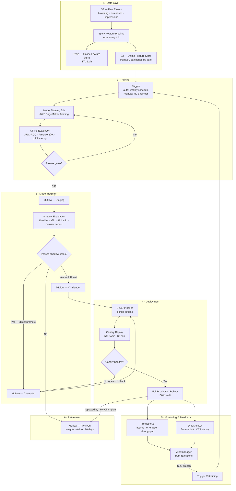

# ML Lifecycle — Scenario X: Personalized In-App Recommendations

## Overview

This document describes the end-to-end lifecycle of a recommendation model from data ingestion
through to production serving, monitoring, and retirement. Both the retrieval model (two-tower)
and the ranker model (XGBoost) follow this lifecycle independently but are promoted as a
versioned pipeline bundle.

---

## End-to-End Lifecycle Diagram

---

## Stage Descriptions

### Stage 1 — Data Layer

| Component | Description |
|---|---|
| S3 raw events | Immutable append-only log of user browsing, purchase, and impression events. Partitioned by `dt=YYYY-MM-DD/hour=HH`. Retained 2 years. |
| Spark Feature Pipeline | Reads last 30 days of raw events. Produces 128-dim user embedding inputs and item co-occurrence matrices. Writes to both Redis (online) and S3 (offline/training). Runs every 4 hours via EMR Serverless. |
| Redis online store | Serves pre-computed user feature vectors at request time. TTL 12 h. Keys: `user:{user_id}:features`. |
| S3 offline store | Parquet snapshots used for model training and offline evaluation. Never mutated after write. |

---

### Stage 2 — Training

**Trigger conditions (either):**
- Weekly schedule: every Monday 02:00 UTC
- Manual trigger by ML Engineer via GitHub Actions `workflow_dispatch`
- Automated trigger: drift monitor detects feature distribution shift > 0.15 PSI for 3 consecutive days

**Training jobs:**
- Retrieval model (two-tower): SageMaker Training, `ml.g5.2xlarge`, ~4 hours
- Ranker model (XGBoost): SageMaker Training, `ml.m5.2xlarge`, ~45 minutes
- Both jobs run in parallel; pipeline version bundles their outputs

**Offline evaluation gates (both models must pass):**

| Metric | Gate | Owner |
|---|---|---|
| Retrieval AUC-ROC | ≥ 0.82 | Automated |
| Retrieval Recall@500 | ≥ 0.75 | Automated |
| Ranker NDCG@20 | ≥ 0.41 | Automated |
| p95 inference latency (retrieval) | ≤ 40 ms | Automated |
| p95 inference latency (ranker) | ≤ 20 ms | Automated |
| Training data freshness | ≤ 7 days old | Automated |
| Human sign-off | Required | ML Engineer |

If any automated gate fails → model is rejected; training job is flagged in MLflow with
`eval_status: failed`. ML Engineer is notified via Slack `#ml-alerts`.

---

### Stage 3 — Model Registry

**Stages:**

| Stage | Meaning | Transition |
|---|---|---|
| `Staging` | Passed offline evaluation; awaiting shadow test | Automated on eval pass + ML Engineer sign-off |
| `Challenger` | Running in shadow / A/B test against Champion | ML Engineer promotes from Staging First runs as shadow (10% traffic, 48 h) before A/B test begins. ML Engineer promotes from Staging. |
| `Champion` | Serving 100% (or 50%) of production traffic | ML Engineer promotes from Challenger after A/B win |
| `Archived` | Retired; weights retained 90 days then deleted | Automated on Champion replacement |

**Shadow evaluation (Staging → Challenger gate):**
- Challenger receives a copy of 10% of live traffic (response not shown to users)
- Runs for minimum 48 hours
- Gates: p95 latency ≤ 110 ms end-to-end, error rate < 0.1%, CTR parity within 5% of Champion

**A/B promotion (Challenger → Champion gate):**
- A/B test runs for minimum 2 weeks (statistical power ≥ 80%)
- Primary metric: add-to-cart rate
- Secondary metrics: CTR, session depth, revenue per session
- Decision: ML Engineer + Product Lead joint sign-off

---

### Stage 4 — Deployment

Deployment is triggered by a registry stage change (`Challenger` or `Champion` tag update).
The CI/CD pipeline (see `cicd/.github/workflows/deploy-model.yml`) executes:

1. Pull model artifact URI from MLflow registry
2. Update `MODEL_S3_PATH` env var in Kubernetes deployment manifest
3. Rolling restart of Triton pods (init-container downloads new weights from S3)
4. Canary: route 5% of traffic to new pods for 30 minutes
5. Automated canary health check: p95 latency ≤ 120 ms, error rate < 0.5%
6. If healthy → full rollout; if not → automatic rollback to previous `MODEL_S3_PATH`

Image tag is unchanged unless serving code was also modified. Model swap ≠ image rebuild.

---

### Stage 5 — Monitoring & Feedback

| Signal | Tool | Alert Condition |
|---|---|---|
| p95 request latency | Prometheus + Alertmanager | > 120 ms for 5 min (warning), > 150 ms for 2 min (critical) |
| Error rate | Prometheus | > 1% for 5 min |
| Model version mismatch | Prometheus (`X-Model-Version` label) | Multiple versions serving unexpectedly |
| Feature drift (PSI) | Offline drift job, runs daily | PSI > 0.15 on user embedding distribution |
| CTR decay | Offline metrics job, runs daily | CTR drops > 15% vs. 7-day rolling average |
| Cold-start rate | Prometheus | > 20% of requests are cold-start |

Full alert definitions: see `monitoring/alerts.yaml`.

---

### Stage 6 — Retirement

- When a new Champion is promoted, the previous Champion moves to `Archived`
- Archived model weights are retained in S3 for 90 days (supports rollback runbook)
- After 90 days, weights are deleted; MLflow metadata is retained permanently for audit
- Retirement is logged in MLflow with `archived_by`, `archived_at`, and `replaced_by_version` fields

---

## Roles and Responsibilities

| Role | Responsibilities |
|---|---|
| **ML Engineer** | Triggers training, reviews offline eval results, signs off on Staging promotion, leads A/B analysis |
| **Product Lead** | Joint sign-off on Champion promotion after A/B test |
| **Platform Engineer** | Maintains CI/CD pipeline, Triton infrastructure, and Redis cluster |
| **On-Call Engineer** | Responds to Alertmanager pages; executes rollback runbook if needed |
